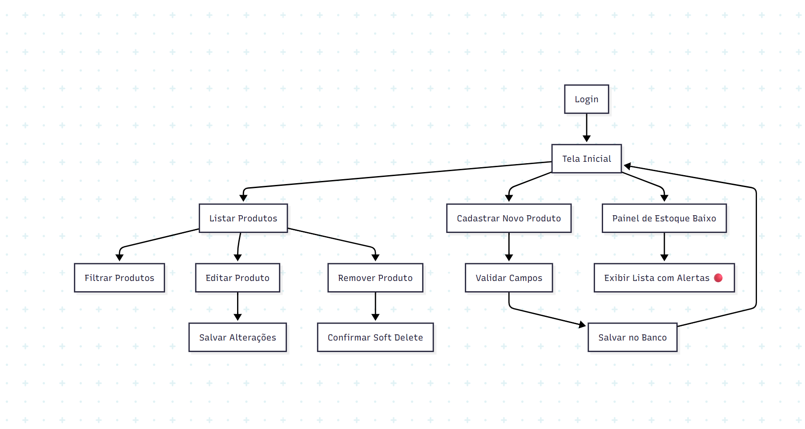
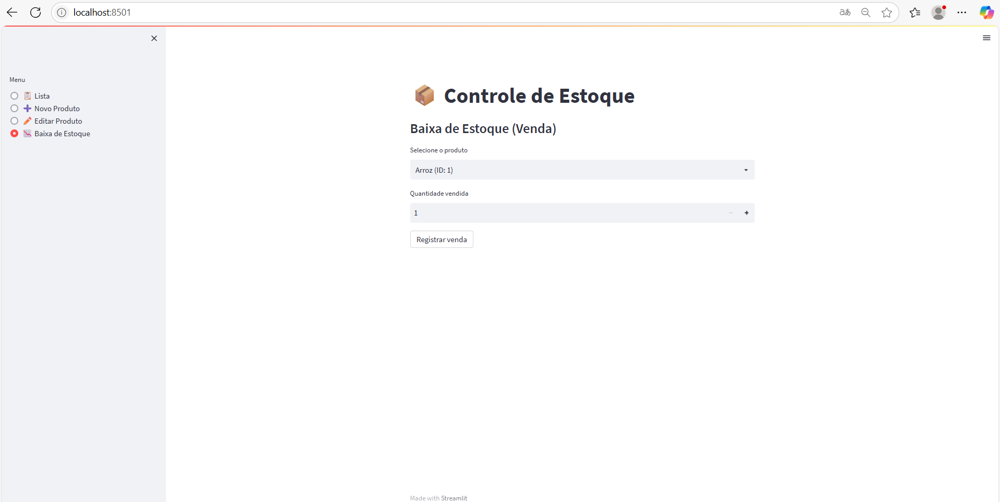
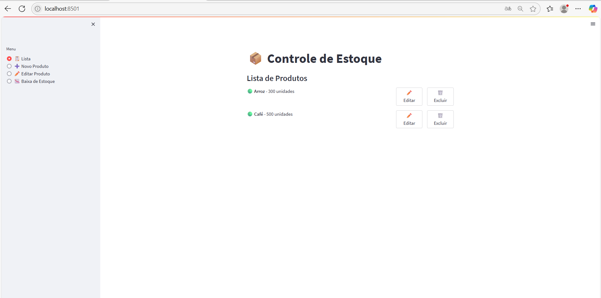
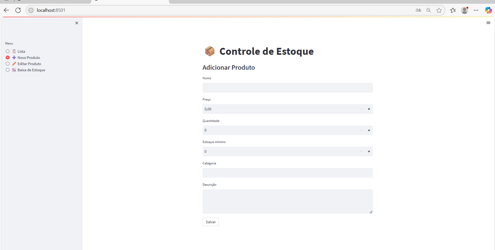

# 📦 Controle de Estoque

Aplicativo simples para gerenciamento de estoque de produtos, com CRUD e alertas de estoque mínimo, utilizando **Python 3.9.7** e **Streamlit**.

---

## 🧰 Tecnologias Utilizadas

- Python 3.9.7
- Streamlit (Interface Web)
- SQLAlchemy (ORM)
- SQLite (Banco de dados local)
- dotenv (Configuração via .env)

---

## 🚀 Funcionalidades

- Cadastro, edição e exclusão de produtos
- Alerta visual para produtos com estoque abaixo do mínimo
- Listagem e filtro de produtos
- Interface amigável com Streamlit

---

## 📁 Estrutura de Pastas

```
controle_estoque/
├── app.py              # Interface Streamlit
├── database.py         # Conexão com banco de dados
├── models.py           # Modelo ORM Produto
├── services.py         # Operações CRUD
├── schema.prisma       # (Opcional) Definição de schema Prisma
├── .env                # Variáveis de ambiente
├── requirements.txt    # Pacotes necessários
└── README.md           # Este documento
```

---

## ⚙️ Como Instalar e Rodar o Projeto

### 1. Clonar ou baixar o projeto

```bash
git clone <repositorio>
cd controle_estoque
```

Ou baixe o `.zip` e extraia.

---

### 2. Criar ambiente virtual (opcional, mas recomendado)

```bash
python3.9 -m venv venv
source venv/bin/activate  # Linux/macOS
venv\Scripts\activate   # Windows
```

---

### 3. Instalar dependências

```bash
pip install -r requirements.txt
```

---

### 4. Rodar a aplicação

```bash
streamlit run app.py
```

---

## 🧠 Diagrama de Fluxo (UX) - Mermaid


---


Evidências:







